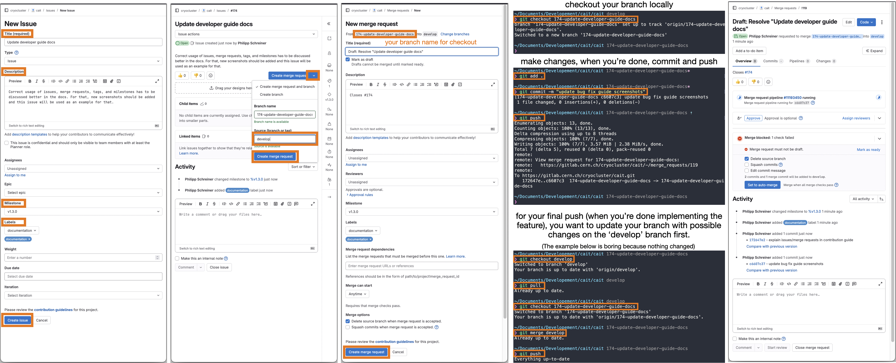
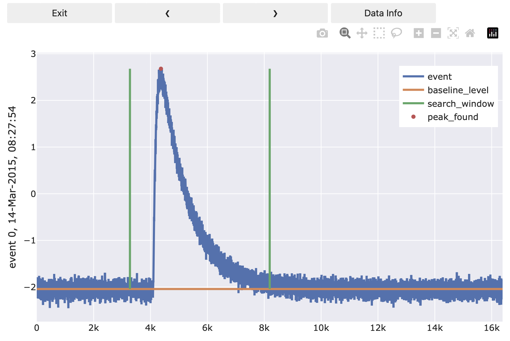
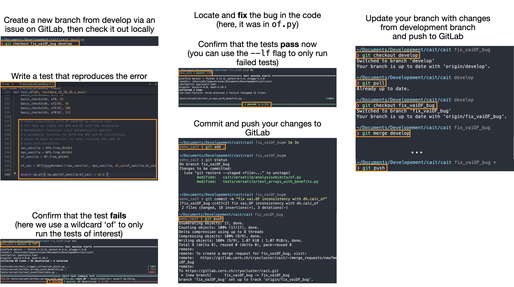

Community and Contributing
==========================

This page is to credit significant contributions to the ``cait`` software package. Today, most contributions come from a small team at the Institute of High Energy Physics in Vienna and the CRESST/COSINUS collaborations. However, the project is still in an early stage and we are actively looking for people willing to contribute, especially also from diverse institutions and backgrounds. If you are interested in the software and motivated to contribute, please get in touch with one of our correspondents, listed below. For feature requests, please also get in touch or open an issue on GitLab/GitHub including the label "Feature Request" in its headline.

Core developers (alphabetical list):

- Philipp Schreiner (development coordination, philipp.schreiner(at)oeaw.ac.at)
- Felix Wagner

Currently all contributors are part of the CRESST and COSINUS collaborations.

You want to contribute? Read the following

.. include:: ../../CONTRIBUTING.rst

Cait long-term plan
~~~~~~~~~~~~~~~~~~~
``Cait`` has started as a more-or-less one-person project and is now slowly attracting more developers/contributors. To make further development as efficient, easy, and maintainable as possible, we ask all developers to stick to the following design philosophy:

Eventually, most features should be plug-and-play for users to access through ``DataHandler`` mixin methods (see :ref:`DataHandler class <thedatahandlerclass>`). However, we realized that starting to write a mixin directly can produce quite a lot of duplicate and hard to maintain code. We consider it more desirable to abstract the problem as far as possible (or reasonable), write a function that solves this problem, and then use this/these function(s) in mixin methods. There is a high chance that some other developer in the future will have the same (abstract) problem and can use the function you already implemented. This way, we save time and in case we discover a problem with this (abstract) function in the future, we only have to fix the problem in one spot in the code.
These (abstract) functions are collected in the :ref:`cait.versatile <caitversatile>` sub-module and should serve as *building blocks* to develop new features. Many building blocks are already available, e.g. to access different file formats, to load event traces from different sources, to subtract/fit baselines, to perform timestamp coincidence calculations, to produce all different kinds of plots, or to efficiently distribute calculations to multiple processes. We **do not want** multiple people to write their own file readers, multi-processing functionality, etc. because it is 1) inefficient and 2) hard to maintain. If you think you can write something in a better/more efficient way than the current 'building block', improve the current 'building block'! This also has the side effect that all the other developers who use this building block profit form it.
To know which building blocks exist, it is of course mandatory that you have a look at the :ref:`cait.versatile <caitversatile>` documentation.

A codebase built from building blocks is not only easier to maintain but also easier to *test*: Currently, the existing ``cait`` features (in the ``DataHandler`` mixin methods) are poorly covered by automated tests. The goal of the 'building blocks' approach is also to have automated tests for its parts and later (when those parts are used in the ``DataHandler`` methods) the latter are automatically covered (to some extent) by the tests. This means that it is **mandatory** (so long as it's reasonable) to write test cases for newly implemented features!
The tests can be run locally using ``pytest`` but they will also automatically run (for multiple different python versions and the latest dependency versions) when opening a merge request on GitLab. This way, any possible deprecation warning of a dependency or a conflict with a more recent python version will be immediately spotted.

In the long run, it would be great if all of ``cait``'s functionality is based on ``cait.versatile`` building blocks which have their respective unit tests. As is always the case, one has more ideas than time ... Therefore, any help is **greatly appreciated**. 

We close this section with a list of things that might be worth discussing or even implementing in the future. Please do *not* consider this to be an 'upcoming features'-list or a 'we *definitely* want this in cait'-list. It just serves as the starting point for discussions.

    - The ``vizTool`` could already provide a default set of ``datasets`` such that the user does not always have to define (mostly the same dictionary).
    - A downsampling option in the ``vizTool`` would be nice, or at least a ``.set_flag`` method in addition to ``.set_idx``
    - The ``DataHandler.content()`` call lists only the names of some of the main parameters (even though all of them are available and accessible). Should we spell out all their names?
    - ``DataHandler.testpulse_stability()`` and ``DataHandler.controlpulse_stability()`` should work for arbitrary group (not just 'events' group).
    - ``DataHandler.controlpulse_stability()`` currently requires the explicit existence of a 'pulse_height' dataset in the HDF5 file. We should make it work with the main parameter 'pulse_height', too. 
    - Do we want a (versatile) analysis object ``Stability`` which takes control pulse amplitudes and timestamps? It could have plot methods for pulse height over time, histograms, ... and whenever you call it with a list of timestamps it returns a corresponding boolean flag with whether it lies in a stable period or not.
    - We have to think about re-writing (parts of) the energy calibration code because currently it still includes deprecated code and maybe starting fresh with an easy to extend class/function (that also has proper test cases) is the better way to go. Once it is easy to extend we can start discussing if we also want more involved fits (like piecewise splines) or a (simultaneous) 2D fit in the timestamp-tpa-tph plane.
    - Stacked histograms analogous to ``vai.Histogram``? Histograms as points with error bars instead of filled bars?
    - In principle, the possibility exists (on branch `versatile_meets_dh`) to *not* copy event traces from stream files to the ``DataHandler`` (HDF5 file), but to only save a reference. This would save a lot of disk space but also make accessing the events slower (disk/speed tradeoff) and *if* it is implemented, we should come up with a solution to the problem of potentially changing file paths (how we update the reference in the ``DataHandler``).

New feature getting started
~~~~~~~~~~~~~~~~~~~~~~~~~~~
This section serves as a starting point for people implementing their first feature in ``cait``. What you will need is a local copy of the ``cait`` repository and install it in *editable* mode. I.e. every time you make a change in the repository, the change is reflected in the python package. We always advice to install ``cait`` in a fresh virtual environment to avoid version conflicts.
We will then walk you through an example of how to implement a simple function using already existing building blocks (in the spirit of `Cait long-term plan`_).

Setting up your working environment and git usage
-------------------------------------------------
First, we will create a separate folder 'CAIT', a virtual environment, clone the ``cait`` repository, and install it.

.. code:: console

    $ mkdir CAIT
    $ cd CAIT
    $ git clone https://gitlab.cern.ch/cryocluster/cait.git
    $ python3 -m venv venv_cait
    $ source venv_cait/bin/activate
    $ python -m pip install —-upgrade pip
    $ python -m pip install jupyterlab pytest
    $ deactivate
    $ source venv_cait/bin/activate
    $ python -m pip install -e cait/
    $ deactivate

You now have everything installed that you will need (including ``jupyterlab`` to work with ``cait`` interactively and ``pytest`` to test it). To get started, call 

.. code:: console

    $ source venv_cait/bin/activate
    $ jupyter-lab

You are currently still on the 'main' branch of the ``cait`` repository that we cloned. When creating new features, you want to do this on a separate *feature branch* which is created *from the develop branch*. The same procedure applies for fixing bugs. To better track the work done on ``cait`` by multiple people, such a branch (either for a new feature or a bug fix) has to be created via an **issue** on *GitLab*. Here is an overview of the steps involved. Below, we also illustrate it with screenshots.

    - Go to **cait>Issues>New Issue**, choose a descriptive title and description, add applicable labels (which describe the thing you want to do), and a milestone (if applicable). Milestones mark goals of new ``cait`` releases, e.g. ``v1.3.0``. If you anticipate your feature/bug fix to be part of such a release, add it in the issue (can also be done afterwards). Click **Create issue**.
    - On the next page, you want to create a dedicated branch and merge request for this issue. Note that nothing will be merged yet, this is just a formality for later. Click the **dropdown** of **Create merge request** and choose **develop** as the source branch. Hit **Create merge request**.
    - On the **New merge request** page you can keep the default fields (all information should be already spelled out in the previously created issue which is mentioned in the description automatically). Click **Create merge request**.
    - Now go to your local ``cait`` repository and checkout your new branch (you can find the name in the merge request, it starts with the issue number). In our case, we use ``git checkout 174-update-developer-guide-docs``.
    - You are now all set up to start implementing changes. Please refer to the coming sections for a 'how-to' and 'best-practice'.
    - After you are done making changes, use ``git add .`` and ``git commit -m 'some commit message'``, then ``git push`` to push your changes to the *GitLab* repository. It will show up on the issue and merge request pages that you created before.
    - Finally, if your feature is fully implemented (or the bug fully fixed), you want to pull from the **develop** branch and locally merge any changes into your feature/issue branch as described in `Merge request`_. Afterwards, the maintainers of ``cait`` will take care of including your code into an upcoming version of ``cait``. Thank you for contributing! :)

.. note::
    Since we installed ``cait`` using the editable ``-e`` flag, its behavior changes when changing branches. *However*, every time you change branch or make a change to the repository, these changes will only be reflected if you *restart* your python session (or just the kernel if you work in a Jupyter notebook).
    To avoid restarting your kernel all the time, consider developing new features directly inside a notebook cell so long as it's convenient, and only copy it into a separate file in the repository once you are done. In our experience, this approach is more convenient than implementing it in the repository directly. However, if you are searching/fixing bugs, e.g., this might not be feasible. 

Building a simple function using ``cait.versatile`` building blocks
-------------------------------------------------------------------
In this section, we want you to imagine that (for some reason) your analysis requires a function to estimate the pulse height of a pulse. To achieve this, you want to load the raw event traces from a ``DataHandler``, subtract their baselines, perform a maximum search, and save the results back to the ``DataHandler``. While developing this function, you will probably use plots to see if your function works as expected.

As mentioned in `Cait long-term plan`_, please use 'building blocks' already available in :ref:`cait.versatile <caitversatile>` and stick to the following scheme as far as possible when developing new features. This way, your only task will be to define the function such that it takes **a single raw event** and calculates the pulse height. You will **not** have to worry about reading events from the ``DataHandler``, applying it to all traces, doing this in a multi-processed way, or saving it back to the ``DataHandler``. Also, plotting diagnostics is trivial as well.

When playing around and prototyping a new function like that we think it's most convenient to just do it in an interactive (Jupyter) notebook. Once you're happy with your result, you can start thinking about including it in the ``cait`` repository (see below).

We first start by creating a ``DataHandler`` (which you probably already have).

.. code:: python

    import numpy as np
    import cait as ai
    import cait.versatile as vai

    # This is the base class for new functions
    from cait.versatile.eventfunctions.functionbase import FncBaseClass

    # Here, we just create a minimal DataHandler with some events inside.
    # You might already have a DataHandler with actual data that you can use.
    dh = ai.DataHandler(nmbr_channels=1)
    dh.set_filepath(path_h5="", fname=f"new_feature_example", appendix=False)
    dh.init_empty()
    dh.include_event_iterator("events", vai.MockData().get_event_iterator()[0])

The ``DataHandler`` in this example consists of 100 events of one channel.

To fit your function into the already existing system and to profit as much as possible from the already implemented features, you will have to, in particular, define the new 'function' as a python class inherited from ``FncBaseClass``. The benefits thereof should hopefully become clear in the following.

The class has an initialization stage, a ``__call__`` function which is the actual functionality that you want to implement, a ``batch_support`` property that is explained below but that you don't really have to worry about at this stage, and a ``preview`` method which will help you visualize what your function is doing. Take your time to study the code below. It might look overwhelming at first, but without all the comments it would be much shorter. Also, we know that this code might have potential for improvement, we just want to illustrate the structure.

.. code:: python 

    # This is the 'function' that we want to define.
    # Note that it has a docstring with parameter descriptions and an example, 
    # comments and type hints!
    class MyFirstCaitFunction(FncBaseClass):
        """
        This function determines the pulse height of an event.

        :param n_baseline: Number of samples to use for estimating the baseline level.
        :type n_baseline: int
        :param search_int: Interval in which to search for the maximum. Defaults to (0,1), i.e. the entire record window.
        :type search_int: tuple, optional

        :return: Determined pulse height
        :rtype: float

        **Example:**

        .. code-block:: python

            # Include an example for how to use your data if it makes sense.
            # Include an image of the output or anything that could help
            # in understanding your function if it makes sense.

        .. image:: media/NewFeatureImplementationTutorialPreview.png
        """
        def __init__(self, n_baseline: int, search_int: tuple = (0,1)):
            # This method initialises your function and it is
            # called without seeing any of the data yet.
            # You can use it for input validation and setting up
            # whatever is needed.
            # PLEASE use type hints for the inputs as shown above!
            self._n_baseline = n_baseline
            self._search_int = search_int
        
        def __call__(self, event: np.ndarray):
            # This method is used when your function is called.
            # Here, you have to write it such that it gets only
            # one input (the event) and you have to return the
            # result of your calculation for one event
            self._baseline_level = np.mean(event[:self._n_baseline])
            self._s = [int(len(event)*x) for x in self._search_int]
            self._peak_pos = np.argmax(event[self._s[0]:self._s[1]]) + int(len(event)*self._search_int[0])
            
            return event[self._peak_pos] - self._baseline_level
            
        @property
        def batch_support(self) -> str:
            # Here you can return either of ['none', 'trivial', 'full'] and it
            # helps the vai.apply function to figure out how well your function
            # can treat data in batches. Most of the time, you will probably want
            # to return 'none' (i.e. your function doesn't support batches and it
            # should be applied separately to each event).
            # If you write the __call__ method above in a vectorized fashion, i.e. 
            # if it also works with an array of events (and then outputs an array
            # of corresponding outputs), AND if there is no 'correlation' between
            # the events (i.e. it's not e.g. two channels of the same event that must
            # be treated TOGETHER), you can return 'trivial'.
            # Finally, if your __call__ method can process multiple events of multiple
            # channels correctly in one call, return 'full'.
            #
            # As mentioned, most of the time you will probably choose 'none', because
            # then you don't have to worry about vectorization. If you need the extra
            # performance boost, you can start worrying about using 'trivial' or 'full'.
            return 'none'
        
        def preview(self, event: np.ndarray) -> dict:
            # This method is called when you use vai.Preview together with an event 
            # iterator and the function you are currently implementing. 
            # It is a convenient way to watch what your function does for both 
            # troubleshooting and developing.
            # This method returns a dictionary which includes instructions on what 
            # vai.Preview should plot. Have a look at the documentation of
            # `cait.versatile.Viewer` to learn what structure this dictionary should have. 
            ph = self(event)
            bl = self._baseline_level
            
            l = {
                "event": [None, event],
                "baseline_level": [None, bl*np.ones_like(event)],
                "search_window": [
                    [self._s[0]]*2+[None]+[self._s[1]]*2, 
                    [bl, bl+ph, None, bl, bl+ph]]
            }
            s = {
                "peak_found": [[self._peak_pos], [bl+ph]]
            }
            return dict(line=l, scatter=s)

Your task is now to get the class above to do what you want from your feature. In particular, this means correctly implementing the ``__call__`` method. Even though it's not 100% necessary, we nevertheless recommend to implement the ``preview`` method, too. Because this allows you to use it together with :class:`cait.versatile.Preview` as shown in the following:

.. code:: python 

    # Create an event iterator as a means to access events from
    # the DataHandler easily
    ev_it = dh.get_event_iterator("events")

    # Initialize your function with the desired input arguments
    f = MyFirstCaitFunction(n_baseline=100, search_int=(0.2, 0.5))

    # Preview the effect of your function onto the events in the iterator
    vai.Preview(ev_it, f)

I.e. the ``preview`` method lets you plot arbitrary diagnostics lines that might be helpful for debugging. Once the plot is opened, you can click through the events in the event iterator to see the effect of your function on one event at a time. Have a look at :class:`cait.versatile.Viewer` where the dictionary structure that ``preview`` should return is explained.

Finally, you can apply your function to all events in your ``DataHandler`` using :func:`cait.versatile.apply`. This function has multi-processing and a progress bar built in already:

.. code:: python 

    # Apply your function defined (and initialized) above to all events
    # that you got from the DataHandler
    all_pulse_heights = vai.apply(f, ev_it)

    # The output can e.g. be visualized in a histogram:
    vai.Histogram(all_pulse_heights)

Including it in the repository and writing a ``DataHandler`` mixin
------------------------------------------------------------------
If your goal was to have an on-the-fly solution for a highly specific issue, you are probably happy with applying your function to all events and be done.
However, if you implemented something that could be relevant for many users, adding it to the repository and also adding a plug-and-play wrapper for the ``DataHandler`` should be considered. E.g. ``DataHandler.calc_mp()`` is such a 'plug-and-play' function. 

    - To add ``MyFirstCaitFunction`` from above to the repository, you would copy its code to the (new) file ``cait/versatile/eventfunctions/scalarfunctions/myfirstcaitfunction.py``. If you are unsure in which directory it should go, reach out to us. To make your function available to users, you also have to add its name to the respective ``__init__.py`` file. In our case, you would add 

       .. code:: python

           from .scalarfunctions.myfirstcaitfunction import MyFirstCaitFunction
    
     to ``cait/versatile/eventfunctions/__init__.py``. Again, if you're unsure about this, just ask. Users can now access your function using ``cait.versatile.MyFirstCaitFunction``. Congrats! You contributed to ``cait``!

    - Implementing a 'plug-and-play' function for the ``DataHandler`` is not much more complicated than that but it requires some more explanations:

Additions to the ``DataHandler`` are done via *mixins* which you find in the repository tree under ``cait/mixins``. If your function fits any of the existing mixins (e.g. if it is some pulse shape parameter calculation, it would fit the ``_data_handler_features.py`` mixin), you can add it to the respective file. But you can also create a new file entirely if it fits nowhere.

The structure of such a file is as follows (example here is some lines of ``_data_handler_features.py``):

.. code:: python

    class FeaturesMixin:
    """
    A Mixin Class to the DataHandler Class with methods for the calculation of features of the data.
    """

        def calc_mp(self, 
                    type: str = 'events', 
                    path_h5: str = None, 
                    processes: int = -1, 
                    down: int = 1,
                    max_bounds: Tuple[int] = None):
            ...

        def calc_additional_mp(self, 
                            type: str = 'events', 
                            path_h5: str = None, 
                            down: int = 1, 
                            no_of: bool = False, 
                            processes: int = -1):
            ...

I.e. the mixin is defined as a class. Its methods will later be the ones called through ``DataHandler.calc_mp()``, etc. 
To let the ``DataHandler`` know about the mixin class, it has to show up in its inheritance list. Currently, the definition of ``DataHandler`` (in ``cait/data_handler.py``) starts with 

.. code:: python 

    class DataHandler(SimulateMixin,
                      RdtMixin,
                      PlotMixin,
                      FeaturesMixin,
                      AnalysisMixin,
                      FitMixin,
                      CsmplMixin,
                      MachineLearningMixin,
                      BinMixin,
                      TriggerCollectionMixin
                      ):

Therefore, if we implement our new function in the ``FeaturesMixin``, we do not have to change anything in the ``DataHandler`` class. But if we create a new mixin, we have to extend the list accordingly.

Finally, writing a wrapper for our ``MyFirstCaitFunction`` implementation above is easily achieved using :func:`~cait.DataHandler.get_event_iterator`, :func:`~cait.versatile.apply`, and :func:`~cait.DataHandler.set`:

.. code:: python

    import cait as ai
    from cait.versatile import MyFirstCaitFunction

    class FeaturesMixin:
        
        def my_first_cait_function(self, 
                                   group: str = 'events', 
                                   n_baseline: int = 100, 
                                   search_int: tuple = (0,1)):
            """Please write a docstring here, too. We will skip it to keep the tutorial short."""

            # Load events (of the correct group) from DataHandler (which is now 'self')
            events = self.get_event_iterator(group=group)

            # Initialize your function
            f = MyFirstCaitFunction(n_baseline=n_baseline, search_int=search_int)

            # Apply it to all events (using all available cores)
            phs = vai.apply(f, events, n_processes=ai._available_workers)
            
            # Save the results to the same group in a dataset called 'my_pulse_heights'
            # We recommend to use overwrite_existing=True such that the user can call
            # your function multiple times without getting an error that the dataset
            # that they are trying to create already exists.
            self.set(group=group, my_pulse_heights=phs, overwrite_existing=True)
        
That's it! You can now use your function as

.. code:: python 

    import cait as ai

    dh = ai.DataHandler(nmbr_channels=1)
    dh.set_filepath(path_h5="", fname=f"new_feature_example", appendix=False)

    dh.my_first_cait_function(group="events", n_baseline=100, search_int=(0.2, 0.5))

and it will create a *my_pulse_heights* dataset in the *events* group.

.. note::

    Now is probably a good time to commit your changes and push them to *GitLab*:

    .. code:: console

        $ git pull
        $ git add .
        $ git commit -m "implement vai.my_first_cait_function and dh.my_first_cait_function"
        $ git push

Implementing test case and running tests
----------------------------------------
Every new feature should come with unit tests that test its behavior. This might not seem relevant at first but those tests will be run automatically on *GitLab* with the latest versions of ``cait``'s dependencies and for different Python versions. If, e.g., a deprecation warning of some dependency is raised sometime in the future, or if someone changes a function that your feature relies on and suddenly your feature breaks unexpectedly, the automated tests will catch it and prevent merging to the develop branch. 

Therefore, it is **important** and **in your own interest** to write test cases for your features.

Test cases can check if your function behaves as expected by e.g. giving it an input for which you know the output. A test would compare the actual output against the expected output. Tests can also target exceptions: Say your function does input validation (which you should always do btw) and raises a ``ValueError`` if the user inputs an inappropriate value. A test could now check if your function correctly raises a ``ValueError`` if provided inappropriate input. 

Tests are implemented in the ``cait/tests`` folder and their folder structure loosely mimics the main code's structure. All files including tests must start with ``test_``. Inside of those files, you define functions (again prefixed with ``test_``) that call your function and test its behavior using ``assert`` to check against known behavior. To check if certain errors are (correctly) raised, you use ``with pytest.raises(ValueError)``. More details can be found in the `pytest docs <https://docs.pytest.org/en/stable/contents.html>`_.

With our minimal example of ``MyFirstCaitFunction`` it is not so easy to think of meaningful test cases. But something like the following should give you an idea of how it's done:

.. code:: python

    from cait.versatile import MyFirstCaitFunction
    
    def test_my_first_cait_function():
        # Initialize your function (would also be good to do this for 
        # multiple arguments etc.)
        f = MyFirstCaitFunction(100, (0.2, 0.5))

        # Somehow create an array that could be a pulse.
        # Here we just create an array of ones and a single
        # sample gets the value 2. 
        event = np.ones(1000)
        event[300] = 2

        # Now we know that our function should return the pulse height 1.
        # Therefore we check for that (yes, there are probably better ways
        # to do that ...)
        assert np.array_equal(f(event), 1)

If you stick to the ``test_`` prefixes correctly, ``pytest`` will automatically find and run your test.
To run all tests, use 

.. code:: console 

    $ pytest

on the top level of the ``cait`` repository. You can run specific tests by providing wildcards 

.. code:: console 

    $ pytest -k 'some_test_that_Im_interested_in'

If some tests failed, and you think you fixed their causes, you can re-run just the failed tests using 

.. code:: console 

    $ pytest --lf

Thank you (in every user's and developer's name) for writing tests!

Merge request
-------------
If all tests pass, your feature is ready to go. Before it can be merged back into the 'develop' branch, however, you should pull the latest changes of the 'develop' branch (which might have received new changes in the meantime) and locally merge them into your feature branch (resolving any potential conflicts). Afterwards, you push to *GitLab* a last time.

.. code:: console

    $ git checkout develop
    $ git pull
    $ git checkout my_new_feature
    $ git merge develop
    $ git push

Then you go to your previously created merge request on *GitLab* where your commit shows up in the timeline.  
All tests will run again for multiple Python versions. If they pass, the main developers of ``cait`` will accept the merge request (if you had the required permissions to do it yourself, you would probably not be reading this guide).

Congratulations! Your feature is now on the develop branch and will be included in the next released version of ``cait``! Thank you so much for contributing :)

Fixing bug getting started
~~~~~~~~~~~~~~~~~~~~~~~~~~
If you come across a bug in ``cait``, it would be fantastic if you tried to fix it yourself. For that, you would go to the ``cait`` *GitLab* repository and create an issue/branch/merge request (as already explained in `Setting up your working environment and git usage`_). On the newly created (issue) branch, the best course of actions is to go to the ``cait/tests/`` folder and write a **test that reproduces** the bug/error you want to fix **before** attempting to **fix** it (see also `Implementing test case and running tests`_). Run the test to confirm that it indeed *fails*. Afterwards, go to the main ``cait/cait/`` folder, locate and fix the bug. Run the tests again to confirm that the (previously failed) test now *passes*. Once it does, commit your changes and push them to GitLab. The commit will show up in your issue of the ``cait`` *GitLab* repository. We will review your changes and accept the request if everything is okay. 

Below, the process is illustrated with some screenshots. Thank you so much for fixing bugs in ``cait``! :)

Tags
~~~~
Tags are created when releasing a new version (see below) and follow the format ``v1.2.3`` where 

- ``1`` denotes a major version (i.e. increasing this implies non-downwards-compatible changes), 
- ``2`` denotes a minor version or feature release (i.e. increasing it implies the implementation of new features which are downwards-compatible), and 
- ``3`` denotes a patch or bug fix (i.e. increasing it implies that it is equivalent to the previous version but with some bugs fixed). 

When a release tag is created, it should always come together with a milestone and release of the respective version (``1.2.3`` in this example) such that people can install this version using 

.. code:: console

    $ python3 -m pip install cait==1.2.3

from PyPI. 

Furthermore, development versions of ``cait`` are also tagged if there was a noteworthy change. This is important to track which version (specified by the tag) was used for an analysis (for people who use the develop branch for their analysis). The development tags follow the format ``v1.3.0.dev1`` where the first part represents the upcoming release tag (resp. milestone) of ``cait``, and the last part denotes the develop version (``1``, ``2``, ...). Note that even though we create tags for development versions, we do not make any development *releases*. However, we **do update** the ``__version__`` in ``_version.py`` accordingly. If you want to install a specific develop version, use 

.. code:: console

    $ python3 -m pip install git+https://gitlab.cern.ch/cryocluster/cait.git@v1.3.0.dev1

Docs
~~~~
If you make changes/additions to the docs (always appreciated), you might want to compile the docs locally. To do so, you can install all docs build dependencies by calling (we assume that you are in the ``cait`` repository)

.. code:: console

    $ python3 -m pip install -e .[docs]

Afterwards, you can run 

.. code:: console

    $ sphinx-build -M html ./docs/source ~/Desktop/docs_build

which builds the docs on your desktop. Open the ``~/Desktop/docs_build/html/index.html`` in your browser to see the docs.

Releasing
~~~~~~~~~

If a new version of ``cait`` is to be released, follow these steps (probably not relevant to you reading this, rather meant as a reference for the core developers):

You probably want to have a separate (clean) python environment for building the package. You need to have ``build`` and ``twine`` installed (``python -m pip install build twine``) and be in the cait repository.

    - Create new version branch (either locally or on *GitLab*, **NOT** *GitHub*)
    - Update version number in ``cait._version``! This will automatically propagate into ``pyproject.toml`` and into the docs via ``conf.py`` and ``.readthedocs.yaml``.
    - Make sure that all tests succeed (run ``pytest``)
    - Delete the old ``build/`` folder that you might still have locally from previous builds
    - Run ``python -m build`` (potentially in a separate environment that you might have set up)
    - Run ``twine check dist/*`` which runs some automatic checks to confirm the success of the build
    - Copy the output wheel file (e.g. to your desktop) and unzip it (it's just a zipped file). Validate that the folder structure after unzipping matches the structure of the cait repository.
    - Do a test upload to **testpypi** using ``twine upload -r testpypi dist/<correct-version>.whl`` (username: '__token__', password: your testpypi-token)
    - Install cait from testpypi (possibly into a fresh environment) using ``python -m pip install -i https://test.pypi.org/simple/ cait --no-dependencies`` to see if any issues occur while pulling.
    - If everything is okay, git commit the wheel file 
    - Create a new tag/release on *GitLab*, following the format ``v1.2.3``
    - Merge version branch into master
    - Upload the wheel also to the actual PyPI using ``twine upload dist/<correct-version>.whl`` (username: '__token__', password: your pypi-token)
    - Tags are synched to *GitHub* (!) but release also has to be created (from tag) on *GitHub*
    - Well done!