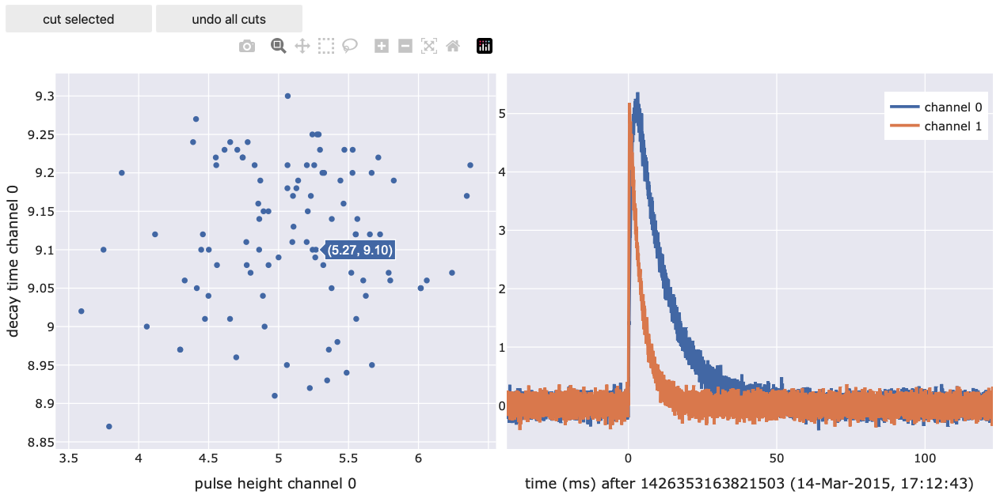

.. _plotting:

********
Plotting
********

``cait.versatile`` offers often used, out-of-the-box plotting routines.
All of them have a number of keyword-arguments which can be used to
style them. Those keyword arguments are:

*  **backend** (str, optional): The backend to use for the plot. Either
   of ``['plotly', 'mpl', 'uniplot', 'auto'``, i.e. plotly, matplotlib
   or uniplot (command-line based; has to be installed separately as
   this is probably not relevant for all users), defaults to ``'auto'``
   in which case ``'plotly'`` is used in notebooks and ``'uniplot'`` on
   the command line (if installed). 

  .. image:: media/backend_comparison.png

*  **template** (str, optional): Valid backend theme. For ``plotly``
   either of
   ``['ggplot2', 'seaborn', 'simple_white', 'plotly', 'plotly_white', 'plotly_dark', 'presentation', 'xgridoff', 'ygridoff', 'gridon', 'none'``,
   for ``mpl`` either of
   ``['default', 'classic', 'Solarize_Light2', '_classic_test_patch', '_mpl-gallery', '_mpl-gallery-nogrid', 'bmh', 'classic', 'dark_background', 'fast', 'fivethirtyeight', 'ggplot', 'grayscale', 'seaborn-v0_8', 'seaborn-v0_8-bright', 'seaborn-v0_8-colorblind', 'seaborn-v0_8-dark', 'seaborn-v0_8-dark-palette', 'seaborn-v0_8-darkgrid', 'seaborn-v0_8-deep', 'seaborn-v0_8-muted', 'seaborn-v0_8-notebook', 'seaborn-v0_8-paper', 'seaborn-v0_8-pastel', 'seaborn-v0_8-poster', 'seaborn-v0_8-talk', 'seaborn-v0_8-ticks', 'seaborn-v0_8-white', 'seaborn-v0_8-whitegrid', 'tableau-colorblind10'``,
   defaults to ``'seaborn'`` for ``backend=plotly`` and to ``'seaborn'``
   for ``backend=mpl``. Note that setting a template for backend
   ``'uniplot'`` has no effect.

*  **height** (int, optional): Figure height, defaults to 500 for
   ``backend=plotly``, 3 for ``backend=mpl`` and 17 for
   ``backend=uniplot``

*  **width** (int, optional): Figure width, defaults to 700 for
   ``backend=plotly``, 5 for ``backend=mpl`` and 60 for
   ``backend=uniplot``

*  **show_controls** (bool): Show button controls to interact with the
   figure. The available buttons depend on the plotting backend. The
   default depends on which higher-level plotting routine is used.
   Available options when ``show_controls=True`` are e.g. ``.png`` and
   ``.pdf`` download of matplotlib figures or the calculation of data
   means/stds of plotly figures.

Furthermore, they provide functions **set_xlabel**, **set_ylabel**,
**set_xscale**, **set_yscale**, **add_line**, **add_scatter**,
**add_histogram**, **update_line**, **update_scatter**,
**update_histogram** to change the appareance of plots after they were
constructed. See documentation of class **Viewer** for details.

Basic Plotting Classes
~~~~~~~~~~~~~~~~~~~~~~

The three basic plotting classes are **Line**, **Scatter**, and
**Histogram**. Their working principle is identical. You can either pass
a list (or ``numpy.ndarray``) to the constructor, or a dictionary whose
keys and values will turn into legend entries and plotted
lines/scatters/histograms. Additionally, you can specify ``xlabel``,
``ylabel``, ``xscale``, ``yscale``, as well as all the general keyword
arguments described above.

.. image:: media/preview_and_streamviewer.png

**Example:**
::

   import cait.versatile as vai

   # If x-data is not provided, the index is used for the x-axis.
   # If y-data is just an array, it will be plotted as such.
   # If y-data is a dictionary, its keys will be used as legend lables and its values are plotted.
   # Axis lables and scales can also be provided.
   
   l = vai.Line([1,2,3,3,2,1])
   vai.Line({'line1': [1,2,3,3,2,1], 'line2': [2,4,6,5,3,1]})
   vai.Scatter([1,2,3,3,2,1], backend="mpl", xlabel="x", template="seaborn")
   vai.Scatter([1,2,3,3,2,1], show_controls=True, backend="mpl")

   # If bins are not provided, the backend's automatic binning is used
   # If bins is an integer, it's the number of bins to use
   # If bins is a tuple of the form (start, end, nbins), it is used to do the binning
   # The functionality of providing just an array for the data as opposed to 
   # a dictionary is identical to Line/Scatter
   
   h = vai.Histogram({'hist1': [1,1,1,2,3,4,4,5,6,7,5,3], 
                  'hist2': [1,1,0,2,3,4,4,0,6,7,5,3]}, 
               bins = 100,
               ylabel='y')

Higher level Plotting Classes
~~~~~~~~~~~~~~~~~~~~~~~~~~~~~

It is very handy to define the following two classes to inspect data
quickly:

-  **Preview**: Inspect events in an event-iterator-object or action of
   a function on those events.
-  **StreamViewer**: View the raw data of a stream file.

|image1|

.. |image1| image:: media/preview_and_streamviewer.png

**Example:**
::

   # `cait.versatile` also includes functions, which implement a `preview` method (see below)
   # It also implements iterators over events.
   # Their interplay can be visualized with `vai.Preview`.
   # Alternatively, it can also be used to show just the iterator of events.
   
   # Show just events in iterator
   it = dh.get_event_iterator("events")
   vai.Preview(it)
   
   # Show effect of removing baseline for events in iterator
   it2 = dh.get_event_iterator("events", 0)
   vai.Preview(it2, vai.RemoveBaseline())

   stream = vai.Stream(hardware="vdaq2", src=fpath)
   vai.StreamViewer(stream, template="plotly_dark", width=1000, downsample_factor=100)

It goes without saying that all the keyword arguments for backend, etc.
work here as well.

-  **ScatterPreview**: A scatter plot where you can click datapoints and preview the underlying voltage trace. Also allows selection and removal of datapoints (similar to ``VizTool``). This tool only works with ``backend='plotly'`` because it requires data selection which is not supported by a general backend.

**Example:**
::
   
   import cait.versatile as vai

   # generate mock data and calculate main parameters
   it = vai.MockData().get_event_iterator().with_processing(vai.RemoveBaseline())
   pulse_height, onset, rise_time, decay_time, slope = vai.apply(vai.CalcMP(dt_us=it.dt_us), it)

   # plot two main parameters and apply some formatting 
   # (assigning it to a variable is not necessary but allows for additional functionality)
   prev = vai.ScatterPreview(x=pulse_height[:,0],
                          y=decay_time[:,0], 
                          ev_it=it, 
                          xlabel="pulse height channel 0", 
                          ylabel="decay time channel 0", 
                          width=500)

You can use the lasso tool to select a number of events. These events are then directly accessible through ``prev.selected_events`` (returns an ``EventIterator``) and ``prev.selected_inds`` (returns the indices of the selected events). Using this, you can for example do things like this:

Documentation
~~~~~~~~~~~~~

.. automodule:: cait.versatile
   :members: Line, Scatter, Histogram, StreamViewer, Preview, Viewer, ScatterPreview
   :show-inheritance: