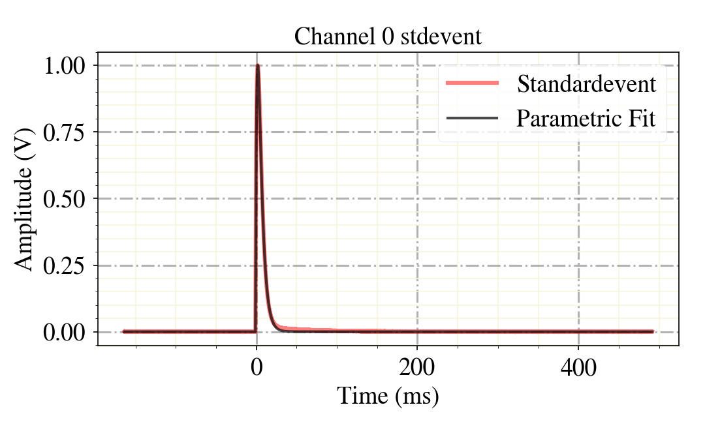

***********
Quick Start
***********

The quickest way to install Cait is via the Python package index:

.. code:: console

    $ pip install cait

For your first steps, you can create a standard event of data from a given *.rdt file with a few lines
of code.

.. code:: python

    >>> import cait as ai
    >>> dh = ai.DataHandler(run='01', module='Test', channels=[0,1])
    DataHandler Instance created.
    >>> dh.convert_dataset(path_rdt='test_data/', fname='mock_001', path_h5='test_data/', tpa_list=[1., 0., -1.])
    Start converting.
    READ EVENTS FROM RDT FILE.
    Total Records in File:  800
    Event Counts:  399
    WORKING ON EVENTS WITH TPA = 0.
    CREATE DATASET WITH EVENTS.
    CALCULATE MAIN PARAMETERS.
    WORKING ON EVENTS WITH TPA = -1.
    CREATE DATASET WITH NOISE.
    Fitting baselines.
    80it [00:00, 23113.89it/s]
    Fitting baselines.
    80it [00:00, 22271.63it/s]
    WORKING ON EVENTS WITH TPA > 0.
    CREATE DATASET WITH TESTPULSES.
    CALCULATE MP.
    Hdf5 dataset created in  test_data/
    Filepath and -name saved.
    >>> dh.calc_sev(decay_time_interval=[(40, 10000), (0, 10000)])

    Calculating SEV for Channel 0
    80 Events handed.
    40 left after decay time cut.
    40 Events used to generate Standardevent.
    Parameters [t0, An, At, tau_n, tau_in, tau_t]:
     [-1.14900745  3.32950471  0.2772284   4.90634228  1.92730517  1.92730525]

    Calculating SEV for Channel 1
    80 Events handed.
    80 left after decay time cut.
    80 Events used to generate Standardevent.
    Parameters [t0, An, At, tau_n, tau_in, tau_t]:
     [ 0.80697635  1.38429859 -0.21063136 33.76615098  4.91408628  1.04188216]
    events SEV calculated.

    >>> dh.show_sev(channel=0)

Once you accomplished this first step into the world of raw data analysis,  start going through the tutorial notebooks,
that demonstrate most of the functionality of Cait.

For producing efficient and fast physics results, check out or hardware- and stream data analysis templates, and the
trigger script! These include the essential steps of the analysis, easily adaptable to any detector.