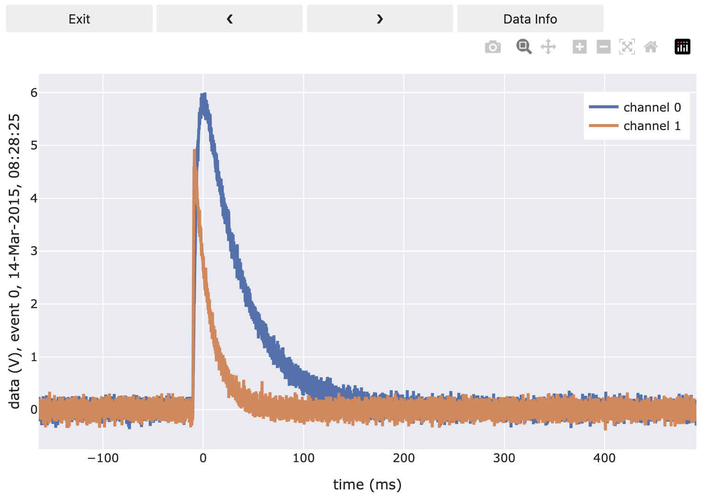
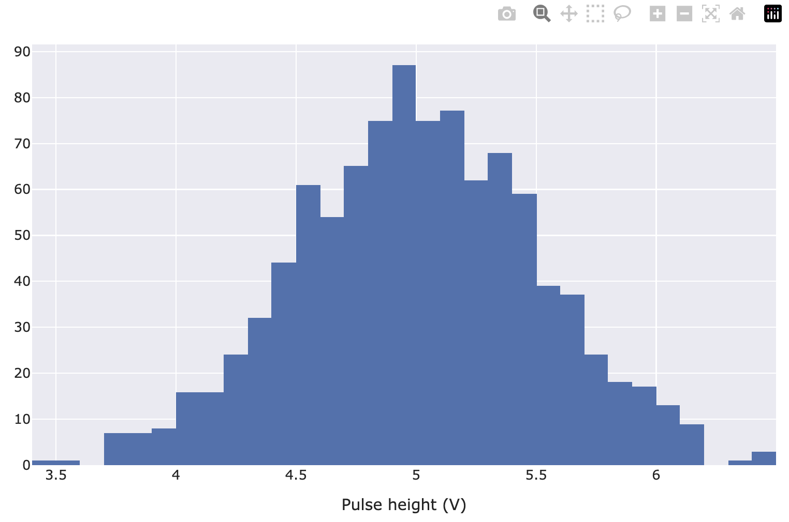

***********
Quick Start
***********

The quickest way to install ``cait`` is via the Python package index:

.. code:: console

    $ pip install cait

To get something working quickly, you can use simulated *mock data*, copy it to the work horse of ``cait`` -- the ``DataHandler``, which stores your analysis results -- calculate pulse shape parameters, and have a look at the pulses and a first pulse height spectrum.

.. code:: python

    import cait as ai
    import cait.versatile as vai

    # Set up a DataHandler instance
    dh = ai.DataHandler(nmbr_channels=2)
    dh.set_filepath(path_h5="", fname="my_first_dh", appendix=False)
    dh.init_empty()

    # Fill it with Mock data and calculate pulse shape parameters
    dh.include_event_iterator("events", vai.MockData(dt_us=dh.dt_us, n_events=1000).get_event_iterator())
    dh.cmp("events")

    # Have a look at the events
    vai.Preview(dh.get_event_iterator("events").with_processing(vai.RemoveBaseline()))

.. code:: python

    # Have a look at pulse heights
    vai.Histogram(dh["events/pulse_height", 0], xlabel="Pulse height (V)")

Once you accomplished this first step into the world of raw data analysis, start going through the tutorial notebooks, that demonstrate most of the functionality of ``cait``.